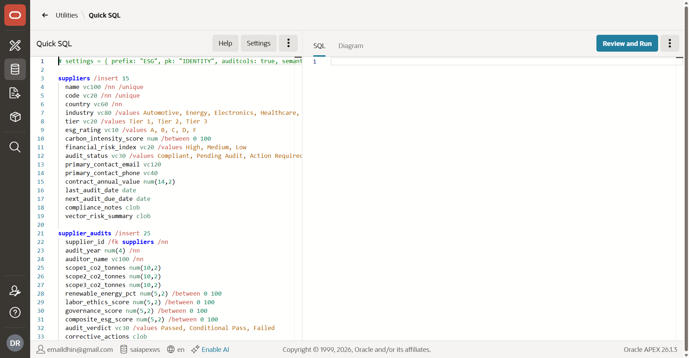
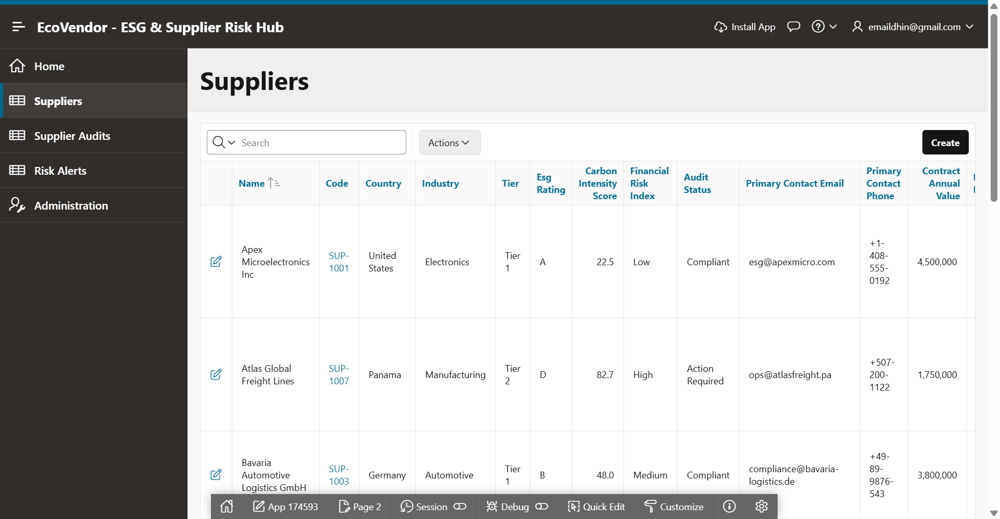
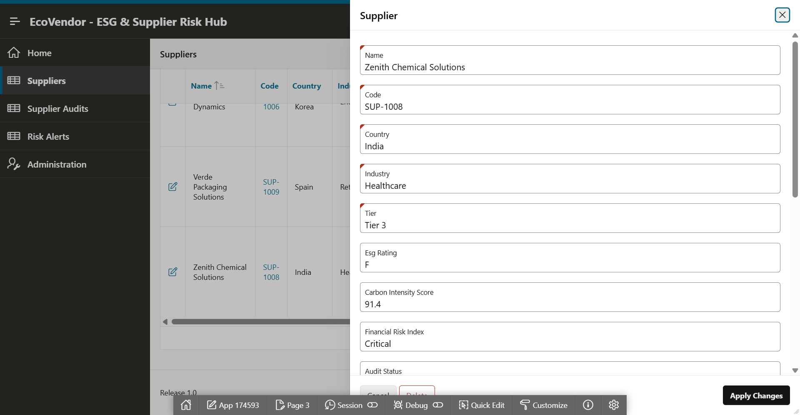
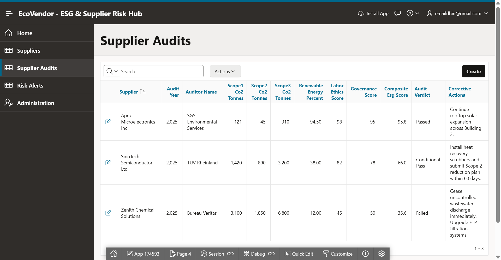
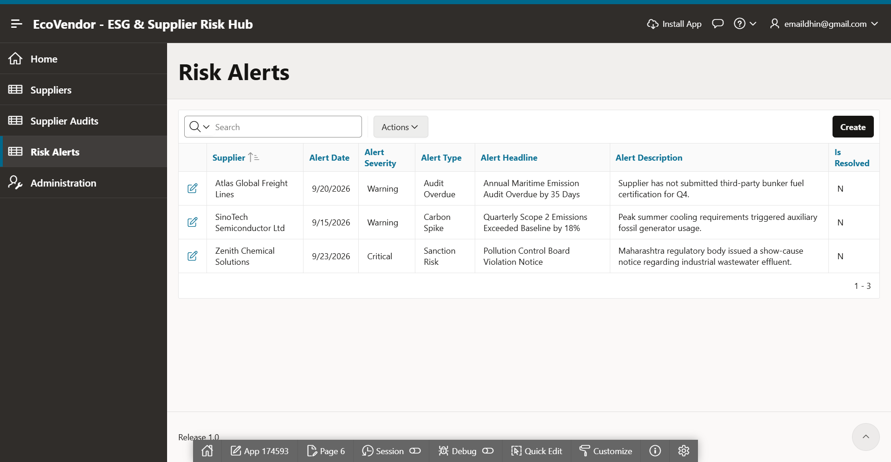

# EcoVendor: Autonomous ESG & Supplier Risk Hub
### Built with an Agent Harness (Claude Code) & APEXLang for Oracle APEX

[](https://apex.oracle.com)
[](LICENSE)

> **EcoVendor** is an enterprise-grade Oracle APEX application designed to automate supply chain sustainability tracking, CSRD compliance, Scope 1-3 carbon accounting, and vendor risk intelligence.

---

## 🚀 Repository Contents

| File / Directory | Description |
|---|---|
| [`apexlang_esg_hub_spec.yaml`](./apexlang_esg_hub_spec.yaml) | Declarative APEXLang application specification defining data models, Redwood UI pages, drawers, and AI assistant metadata. |
| [`quicksql_esg_hub.sql`](./quicksql_esg_hub.sql) | Quick SQL shorthand script for fast schema generation in Oracle APEX SQL Workshop. |
| [`esg_schema_clean.sql`](./esg_schema_clean.sql) | Complete Oracle Database DDL script with tables (`ESG_SUPPLIERS`, `ESG_SUPPLIER_AUDITS`, `ESG_RISK_ALERTS`), constraints, audit triggers, and sample dataset. |
| [`screenshots/`](./screenshots/) | High-resolution hands-on screenshots from the live deployment on Oracle APEX. |

---

## 🏗️ Architecture & Generation Flow

```
+-----------------------------------------------------------+
|               Enterprise Business Context                 |
|   (CSRD Mandates, Scope 1-3 Rules, Vendor Credit Ratings) |
+-----------------------------+-----------------------------+
                              |
                              v
+-----------------------------------------------------------+
|                      Claude Code Agent                    |
|         (Domain Reasoner & Schema Synthesis Engine)       |
+-----------------------------+-----------------------------+
                              |
                              v
+-----------------------------------------------------------+
|                     APEXLang Artifact                     |
|  - Quick SQL Schema (Tables, Constraints, Triggers, Data) |
|  - Page Hierarchies (Faceted Search, Drawers, Cards, AI)  |
+-----------------------------+-----------------------------+
                              |
                              v
+-----------------------------------------------------------+
|                  Oracle APEX App Builder                  |
|  - 1-Click Schema Execution (DDL + Audit Triggers)        |
|  - Responsive Redwood UI Pages & Dynamic Actions          |
+-----------------------------------------------------------+
```

---

## ⚡ Quickstart Deployment in Oracle APEX

1. **Log in** to your Oracle APEX workspace.
2. Navigate to **SQL Workshop ➔ SQL Scripts ➔ Upload**.
3. Upload and run [`esg_schema_clean.sql`](./esg_schema_clean.sql).
4. On the Results screen, click **Create App from Script**.
5. Set Name to `EcoVendor - ESG & Supplier Risk Hub` and enable Progressive Web App (PWA).
6. Click **Create Application** and launch!

---

## 📸 Screenshots

### 1. Quick SQL Compilation


### 2. Suppliers Interactive Report


### 3. Slide-out Supplier Audit Drawer


### 4. Multi-Year Carbon & ESG Audits


### 5. Real-Time Risk Alerts Feed


---

## 📄 License
This project is open-sourced under the MIT License.
