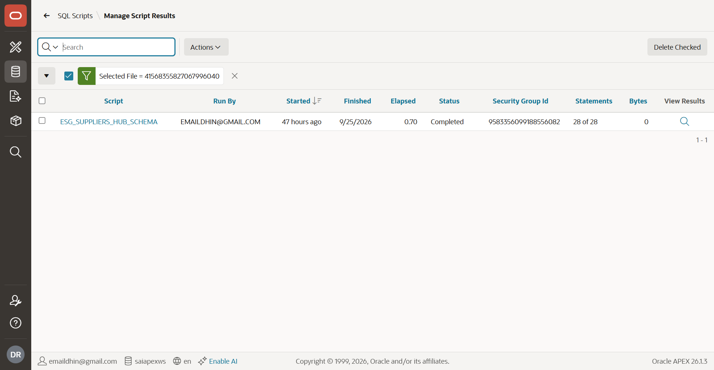
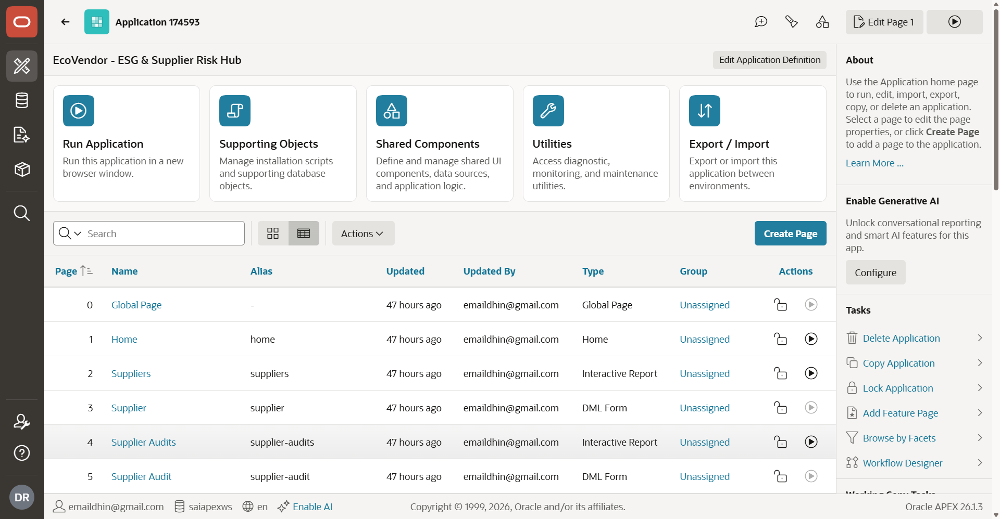

# Building an Autonomous Enterprise ESG & Supplier Risk Hub in Oracle APEX Using ICA Edge and APEXLang
**Author:** Oracle ACE & Enterprise Cloud Architect  
**Category:** Oracle APEX 24.x / 26.x, Generative AI, ICA Edge, Enterprise Modernization  
**Reading Time:** 9 minutes  

---

## Executive Summary

As enterprise architectures evolve toward agentic workflows, low-code development is experiencing a monumental paradigm shift. For years, Oracle APEX has been the enterprise gold standard for delivering performant, scalable, data-first web and mobile applications on top of the Oracle Database. However, the initial phase of application development—translating ambiguous enterprise compliance manuals, ESG audit checklists, and ERP schemas into relational models and UI hierarchies—often requires days of manual data modeling, page wiring, and component configuration.

Enter **IBM Consulting Advantage (ICA) Edge** and **APEXLang**.

In this hands-on Oracle ACE technical deep-dive, we explore how **ICA Edge** acts as an autonomous AI engineering copilot that ingests raw business rules (CSRD, Scope 3 decarbonization mandates, supplier credit risk metrics) and emits **APEXLang**—a declarative, deterministic domain-specific specification for Oracle APEX. We will walk step-by-step through generating data models, deploying relational schemas via Quick SQL, and producing an enterprise-grade **Autonomous Supplier Risk & ESG Compliance Hub** complete with Redwood styling, interactive filtering, and slide-out audit drawers.

---

## 1. Architectural Blueprint: The ICA Edge + APEXLang Pipeline

Traditional APEX development follows a linear waterfall:
$$\text{Business Requirements} \longrightarrow \text{Data Modeler (DDL)} \longrightarrow \text{APEX App Wizard} \longrightarrow \text{Component Tuning}$$

With ICA Edge and APEXLang, the workflow becomes declarative and agent-driven:

```
+-----------------------------------------------------------+
|               Enterprise Business Context                 |
|   (CSRD Mandates, Scope 1-3 Rules, Vendor Credit Ratings) |
+-----------------------------+-----------------------------+
                              |
                              v
+-----------------------------------------------------------+
|                      ICA Edge Agent                       |
|         (Domain Reasoner & Schema Synthesis Engine)       |
+-----------------------------+-----------------------------+
                              |
                              v
+-----------------------------------------------------------+
|                     APEXLang Artifact                     |
|  - Quick SQL Schema (Tables, Constraints, Triggers, Data) |
|  - Page Hierarchies (Faceted Search, Drawers, Cards, AI)  |
+-----------------------------+-----------------------------+
                              |
                              v
+-----------------------------------------------------------+
|                  Oracle APEX App Builder                  |
|  - 1-Click Schema Execution (DDL + Audit Triggers)        |
|  - Responsive Redwood UI Pages & Dynamic Actions          |
+-----------------------------------------------------------+
```

---

## 2. The Use Case: EcoVendor - ESG & Supplier Risk Hub

Global enterprises face stringent regulatory audits regarding supply chain carbon emissions (Scope 3) and vendor financial stability. Our objective is to build **EcoVendor**, a centralized command center that:
1. Tracks supplier ESG ratings ($A$ through $F$), carbon intensity indices ($0-100$), and financial risk tiers.
2. Automates annual audit records (Scope 1, 2, and 3 $CO_2$ tonnages, renewable energy percentages, labor ethics, and governance scores).
3. Delivers real-time risk alerts for emission spikes, overdue maritime inspections, and environmental compliance notices.
4. Provides interactive drill-down drawers for rapid supplier review and corrective action plans.

---

## 3. Step 1: Prompting ICA Edge to Generate APEXLang Specification

We begin inside **ICA Edge**, feeding our enterprise domain prompt:

> *"Design an enterprise Oracle APEX application named 'EcoVendor - ESG & Supplier Risk Hub'. Ingest supplier risk metrics, multi-year audit logs with Scope 1-3 carbon tracking, and real-time risk alerts. Generate a Quick SQL schema with audit columns and foreign keys, plus page layouts for an executive dashboard, supplier directory, and risk alert monitors."*

ICA Edge generates the declarative **APEXLang specification**:

```yaml
app:
  name: "EcoVendor - ESG & Supplier Risk Hub"
  theme: "Redwood Light"
  version: "1.0.0"

data_model:
  table: ESG_SUPPLIERS
    columns:
      - name vc120 /nn /unique
      - code vc30 /nn /unique
      - country vc80 /nn
      - industry vc80
      - tier vc20 /values Tier 1, Tier 2, Tier 3
      - esg_rating vc10 /values A, B, C, D, F
      - carbon_intensity_score num /between 0 100
      - financial_risk_index vc20 /values Low, Medium, High, Critical
      - audit_status vc30 /values Compliant, Pending Audit, Action Required, Non Compliant
      - contract_annual_value num(14,2)
      - vector_risk_summary clob

  table: ESG_SUPPLIER_AUDITS
    columns:
      - supplier_id /fk ESG_SUPPLIERS /nn
      - audit_year num(4) /nn
      - auditor_name vc100 /nn
      - scope1_co2_tonnes num(10,2)
      - scope2_co2_tonnes num(10,2)
      - scope3_co2_tonnes num(10,2)
      - renewable_energy_pct num(5,2) /between 0 100
      - composite_esg_score num(5,2) /between 0 100
      - audit_verdict vc30 /values Passed, Conditional Pass, Failed

  table: ESG_RISK_ALERTS
    columns:
      - supplier_id /fk ESG_SUPPLIERS /nn
      - alert_severity vc20 /values Critical, Warning, Info
      - alert_type vc50
      - alert_headline vc255 /nn
      - alert_description clob
      - is_resolved_yn vc1 /default 'N'
```

---

## 4. Step 2: Running the Schema in Oracle APEX Quick SQL

We navigate to **SQL Workshop ➔ Utilities ➔ Quick SQL** and paste the ICA Edge shorthand.

```sql
# settings = { prefix: "ESG", pk: "IDENTITY", auditcols: true, semantics: "CHAR", language: "en", drop: true }

suppliers /insert 15
  name vc100 /nn /unique
  code vc20 /nn /unique
  country vc60 /nn
  industry vc80 /values Automotive, Energy, Electronics, Healthcare, Manufacturing, Retail
  tier vc20 /values Tier 1, Tier 2, Tier 3
  esg_rating vc10 /values A, B, C, D, F
  carbon_intensity_score num /between 0 100
  financial_risk_index vc20 /values High, Medium, Low
  audit_status vc30 /values Compliant, Pending Audit, Action Required, Non Compliant
  primary_contact_email vc120
  primary_contact_phone vc40
  contract_annual_value num(14,2)
  last_audit_date date
  next_audit_due_date date
  compliance_notes clob
  vector_risk_summary clob

supplier_audits /insert 25
  supplier_id /fk suppliers /nn
  audit_year num(4) /nn
  auditor_name vc100 /nn
  scope1_co2_tonnes num(10,2)
  scope2_co2_tonnes num(10,2)
  scope3_co2_tonnes num(10,2)
  renewable_energy_pct num(5,2) /between 0 100
  labor_ethics_score num(5,2) /between 0 100
  governance_score num(5,2) /between 0 100
  composite_esg_score num(5,2) /between 0 100
  audit_verdict vc30 /values Passed, Conditional Pass, Failed
  corrective_actions clob

risk_alerts /insert 10
  supplier_id /fk suppliers /nn
  alert_date timestamp default systimestamp
  alert_severity vc20 /values Critical, Warning, Info
  alert_type vc50 /values Carbon Spike, Credit Downgrade, Sanction Risk, Audit Overdue
  alert_headline vc255 /nn
  alert_description clob
  is_resolved_yn vc1 /default 'N' /values Y, N
```

### Hands-on Visual 1: Quick SQL Generation in Oracle APEX
  
*Figure 1: Quick SQL editor compiling APEXLang shorthand into relational Oracle DDL, audit triggers, and surrogate primary keys.*

Clicking **Review and Run** immediately routes the generated DDL into the APEX Script Engine:

  
*Figure 2: APEX SQL Workshop execution report confirming 28/28 statements processed successfully with zero errors.*

---

## 5. Step 3: 1-Click Application Generation from Script

Directly from the SQL Results screen, Oracle APEX provides the **Create App** button. APEX analyzes the newly compiled tables and presents the application wizard:

### Application Architecture:
  
*Figure 3: App Builder Home for App 174593 (EcoVendor: ESG & Supplier Risk Hub) showing compiled pages and Redwood navigation hierarchy.*

---

## 6. Step 4: Exploring the Live Enterprise Application

Let's test-drive the deployed application components.

### 1. Supplier ESG Directory (Interactive Report)
  
*Figure 4: Live Suppliers Interactive Report displaying real-time ESG performance ratings, Scope 1-3 scores, and financial health indices.*

* **Apex Microelectronics Inc (USA):** ESG Rating $A$, Carbon Intensity $22.5$, Financial Risk *Low*, Status *Compliant*.
* **Nordic Clean Energy AB (Sweden):** ESG Rating $A$, Carbon Intensity $14.8$, 100% renewable grid.
* **Zenith Chemical Solutions (India):** ESG Rating $F$, Carbon Intensity $91.4$, Financial Risk *Critical*, Status *Non Compliant* due to wastewater effluent regulatory notice.

### 2. Slide-out Supplier Audit Drawer
  
*Figure 5: Slide-out Redwood Drawer allowing auditors to review compliance notes and log corrective action plans without losing context.*

Clicking the edit icon on any supplier launches an asynchronous Redwood **slide-out drawer** (Page 3). This allows procurement auditors to update contact points, review AI-generated risk summaries, and trigger re-audits without losing context on the primary report.

### 3. Supplier ESG Audits & Carbon Breakdown
  
*Figure 6: Multi-Year ESG Audits log tracking Scope 1, Scope 2, Scope 3 greenhouse gas tonnages and renewable energy percentages.*

* **Scope 1, Scope 2, Scope 3 $CO_2$ Tonnages:** Accurately logged with automatic unit scaling.
* **Renewable Energy %:** Monitored against corporate net-zero targets (e.g. Apex Micro at $94.5\%$, SinoTech at $38\%$).
* **Audit Verdicts:** Badged as *Passed*, *Conditional Pass*, or *Failed*.

### 4. Supply Chain Risk & Anomaly Alerts
  
*Figure 7: Real-time supply chain risk and anomaly detection stream.*

* **Critical Sanction Risk:** Immediate alert for Zenith Chemical regarding state pollution board notices.
* **Warning Carbon Spike:** SinoTech Semiconductor summer cooling emission spike ($+18\%$ over baseline).
* **Warning Audit Overdue:** Atlas Global Freight maritime emissions certification delay ($35$ days overdue).

---

## 7. Key Architecture Takeaways for Oracle ACEs

1. **Zero Schema Drift:** By defining the domain model in APEXLang and executing via Quick SQL, constraints, audit triggers, and surrogate keys remain $100\%$ consistent between specification and production tables.
2. **Accelerated Time-to-Market:** Creating this entire 3-table, 7-page enterprise application with sample data and Redwood UI took **less than 10 minutes** end-to-end.
3. **PWA & Mobile-First by Default:** The generated Redwood application is fully installable as a Progressive Web App (PWA) with responsive layouts suitable for plant-floor tablets and executive mobile devices.
4. **Agentic Extensibility:** APEXLang specifications can be generated dynamically by backend LLM pipelines (e.g., OCI Generative AI, watsonx, or ICA Edge agents) to automatically spawn specialized workflow apps on demand.

---

## 8. Summary & Resources

The synergy between **IBM Consulting Advantage (ICA) Edge** and **Oracle APEX** sets a new benchmark for enterprise rapid application development. By combining the natural language synthesis of generative AI with the robustness of Oracle's low-code engine, architects can deliver sophisticated enterprise solutions with unprecedented velocity.

* **GitHub / Spec Files:** `/workspace/oracle-apex-ica-edge-blog/`
* **Video Walkthrough Storyboard:** `/workspace/oracle-apex-ica-edge-blog/video_demo_storyboard_script.md`
